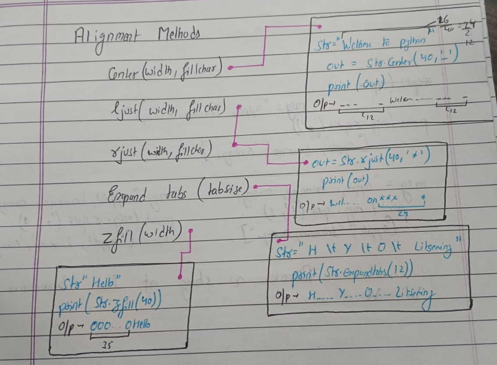

#### Basic Python
---

> Some Important Points
- **Floating Point Precision:** 16 to 17 digits
- **Escape Sequence:** ("\'s") results ('s)
- **Seperator:** Print(a,b,c, sep='@') results (a@b@c)
- **Loop with else:** Only executes if loop terminated without break

> Operators
- **Airthmatic:** (+ - * / % //)
- **Comparison:** (== != < > <= >=)
- **Assignment:** (= &= |= ^= += -= *= /= %= //=)
- **Logical:** (&& || ^)
- **Identity:** (is, is not)
- **Membership:** (in, not in)
- **Bitwise:** (& | ^ - << >>)

>String

- **str = "Hello"** here | -5 H 0 | -4 e 1 | -3 l 2 | -2 l 1 | -1 o 0
- **slice:** str[1:3] results: ell
  
- **Concatenating operators** 
  1. Mod Operator: print("%s sir", %str)
  2. Join Operator: print('@'.join([str,str2])) for str2 = " World!"
  3. F String Operator: print(f"Hello {str2}")

- **Case-Conversion Methods** 
  1.  capitalize()
  2.  caefold()
  3.  lower()
  4.  upper()
  5.  swapcase()
  6.  title()

- **Alignment Methods** 
  

- **Strip Method**: Removes Char from end
```python
mgs = "__Hello_World__  "
print(mgs.rstrip('_'))
print(mgs.lstrip('_'))
print(mgs.strip(' '))
result = '__Hello_World', 'Hello_World__', '__Hello_World__'
```

- **Split Method**: split char from right and left
```python
msg = "apple, banana, orange"
print(msg.split(','))       # ['apple', ' banana', ' orange']
print(msg.rsplit(',',1))    # ['apple, banana', ' orange']      ->  r to l
print(msg.split(',',1))     # ['apple', ' banana, orange']      ->  l to r
```

- **Partition Method**: split char from right and left and keep char

```python
msg = "apple, banana, orange"
print(msg.partition(','))     # ('apple', ',', ' banana, orange')
print(msg.rpartition(','))    # ('apple, banana', ',', ' orange')
```

- **removeprefix and removesuffix() Method**: Also removes matching char

```python
msg = "Hello World"
print(msg.removeprefix("Hello "))     # World
print(msg.removesuffix(" World"))     # Hello
```

- **Count, Find, Index, Replace:** 

```python
msg.count("apple")                # 2

msg.find("banana")                # 6
msg.index("banana")               # 6

msg.find("xyz")                   # -1
msg.index("xyz")                  # val error

msg.replace("apple", "mango")     # "mango banana mango"

```